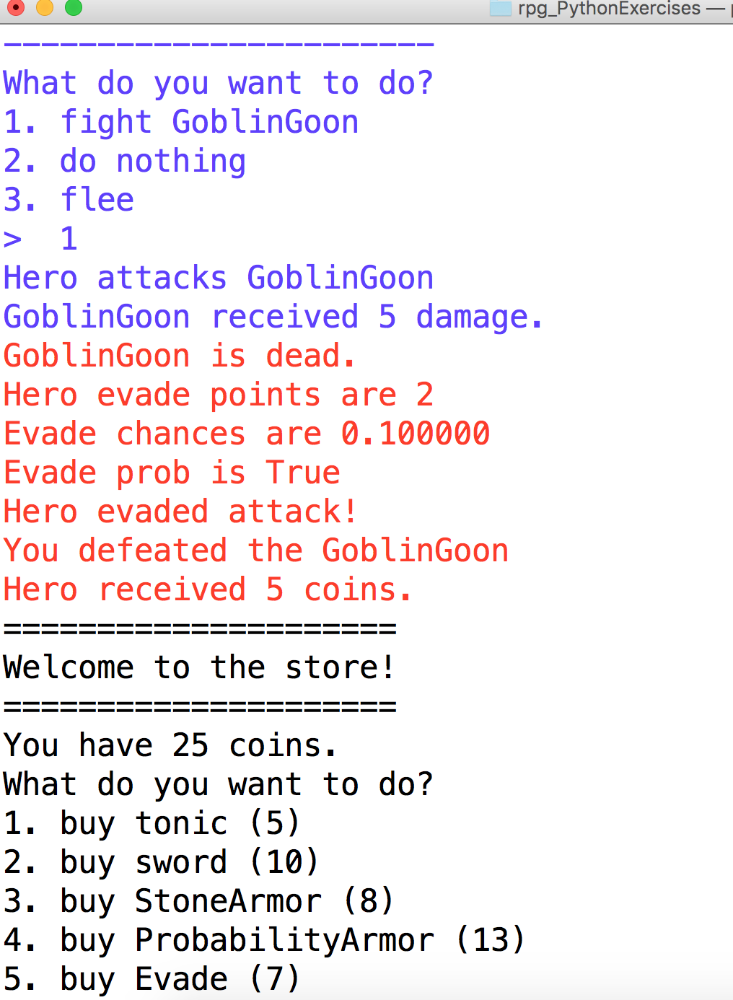

# rpg_PythonExercises
Learning about inheritance by making multiple characters in an RPG inherit essentials like:

* Health
* Attack Power
* Coinss
* Evade

###Finished the game and met the bonus challenge to add color to terminal/console

## Sample Objectives: Character Creation
1. start the game to understand the mechanics at work
2. make the hero generate double damage points during an attack with a probabilty of 20%
3. make a new character called Medic that can sometimes recuperate 2 health points after being attacked with a probability of 20%
4. make a character called Shadow who has only 1 starting health but will only take damage about once out of every ten times he is attacked.
5. make a Zombie character that doesn't die even if his health is below zero
6. come up with at least two other characters with their individual characteristics, and implement them.
7. Give each character a number of "prize coins". For example, the prize for defeating the Goblin is 5 coins, for the Wizard it is 6 coins.
